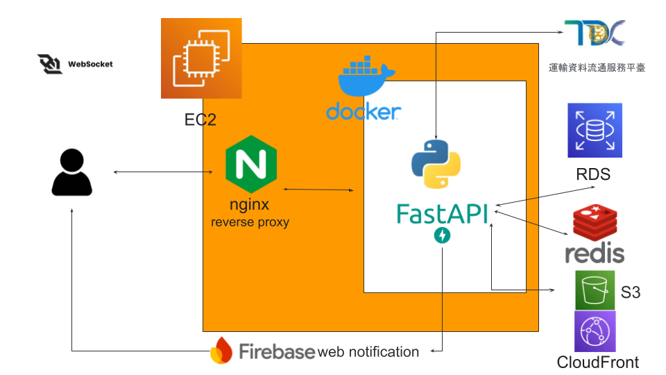
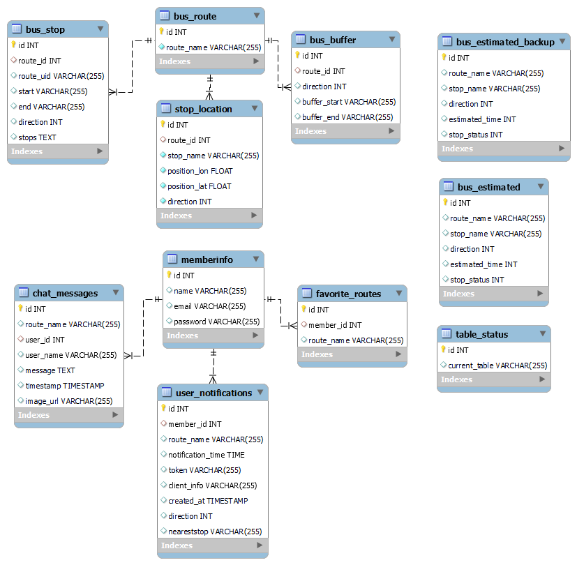
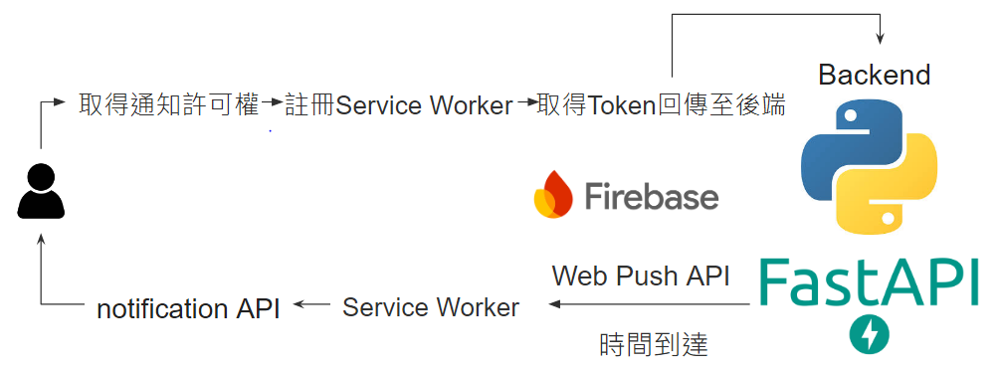
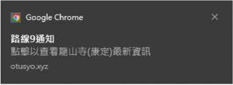
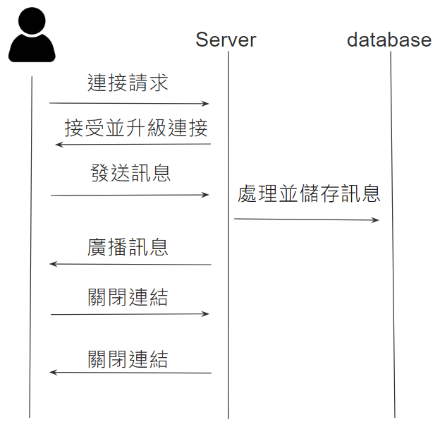

# [台北BusConnect](https://otusyo.xyz/)

### 台北Busconnect是一個增加了自訂通知與用戶聊天室的公車動態資訊網站

台北BusConnect 是一個專為台北市民及遊客設計的實時公車資訊平台，提供即時、精確的公車到站時間與動態資訊。除了傳統的公車查詢功能外，還引入了自訂通知和用戶聊天室功能，使用戶能夠根據個人需求設定通知，並在等車時與其他乘客互動交流。

核心功能
- 實時到站時間查詢：提供準確的公車到站時間，幫助乘客獲取最新資訊。
- 自訂通知：用戶可以設定特定的公車路線和通知時間，系統會自動在指定時間前發送通知以提醒用戶。
- 乘客聊天室：建立即時聊天室功能，讓同一路線的乘客可以互相交流、分享資訊。

使用技術
- 使用 **FastAPI** 與 **RDS MySQL** 資料庫做為後端伺服器的基本架設
- 透過 **Firebase Cloud Messaging** 提供 **Web Notification**，確保用戶能及時收到設定的通知。
- 利用 **WebSocket** 技術實現即時多人聊天
- 使用 **Redis** ， **AWS S3** 以及 **CloudFront** 做靜態檔案與圖片的快取，增加網頁載入速度
- 通過 **Git** 進行版本控制，並透過 **Docker** 包裝部屬在 **AWS EC2** 上

## 系統架構圖

1. 在本地開發階段，我們使用 **Git Flow** 開發方式，主要依據不同的 commit 來區分開發進度，確保版本控制的清晰和穩定。

2. 採用前、後端分離進行開發，並採用MVC架構設計，前端使用 HTML、CSS、JavaScript，後端使用 FastAPI。

3. 用戶連線至伺服器時，會通過 **Nginx** 反向代理，自動升級為 **HTTPS** 連線，以確保資料傳輸的安全性。

4. 使用 **Docker** 將主程式打包，可以與EC2內其他程式隔離，減少伺服器壓力。

5. 後端採用 **FastAPI** 作為應用框架，並使用 **RDS MySQL** 作為主要資料庫，**Redis** 作為快取數據庫，優化系統性能。

6. 通過 **WebSocket** 技術實現乘客之間的即時聊天功能。同時，利用 **Firebase Cloud Messaging** 提供 **Web Notification**，確保用戶即時接收設定的通知提醒。

7. 靜態檔案和圖片透過 **AWS S3** 存儲，並使用 **CloudFront** 作為 CDN 加速，提升網頁載入速度。

8. 外部API 是採用 TDX 運輸資料流通服務平台 API 獲取最新公車到站資訊，透過批量插入等方法優化數據存儲速度。

## 資料庫架構圖

資料庫設計符合第三正規化，並在必要處設置了索引，避免數據冗餘及確保資料庫的高效運行。

bus_route相關: 用於儲存公車靜態資料
- bus_route 表：儲存公車路線的基本資訊。
- bus_stop 表：儲存每條公車路線的停靠站點資訊。
- stop_location 表：儲存每個站點的地理位置資訊。
- bus_buffer 表：儲存公車路線的緩衝區段資訊。

memberinfo相關: 用於儲存會員靜態資料
- memberinfo 表：儲存用戶的基本資訊。
- user_notifications 表：儲存用戶的通知設定資訊。
- favorite_routes 表：儲存用戶的最愛公車路線。
- chat_messages 表：儲存乘客之間的聊天訊息。

bus_estimated相關: 用於儲存公車動態資料
- bus_estimated 表：儲存每條公車路線在各站的預計到達時間和站點狀態。
- bus_estimated_backup 表：備份 bus_estimated 表中的公車預計到達時間數據。
- table_status 表：用於追蹤當前使用的表格狀態或名稱。

在更新動態資訊時，採用兩表輪替，避免用戶接受到更新中的數據。
## Web Notification

1. 初次進入網站時，會去取得用戶的通知許可權，如果用戶點擊同意，就會在瀏覽器註冊 **Service Worker** 。
2. 再來會通過 **Firebase Cloud Messaging** 獲取一個Token，用來識別該瀏覽器的Service Worker，並將該Token與所需資訊傳送至後端。
3. 當用戶設定的時間到時，後端就會自動透過 **Web Push API** 推送到 **Service Worker** ，**Service Worker**再透過 **Notification API** 傳送通知給用戶。

4. 在用戶每次再度進入網站時，系統會檢查該 Token 是否過期，並在必要時更新 Token，然後將新的或已驗證的 Token 與相關資訊傳送至後端伺服器。

## WebSocket 即時聊天室

1. 當用戶進入聊天室頁面時，瀏覽器會發起一個 WebSocket 連接請求。
2. 伺服器端收到這個 WebSocket 連接請求後，會進行用戶的身份驗證（檢查 JWT）。一旦驗證通過，伺服器會接受，並回應 101 Switching Protocols 狀態碼，表示從 HTTP 升級為 WebSocket 連接，為一個持久化連結。
3. 當用戶在聊天室輸入訊息並按下“發送”時，客戶端會通過 WebSocket 將這個訊息傳遞到伺服器。
4. 伺服器收到訊息後，若有圖片會存入AWS S3，處理完畢後將訊息存儲到資料庫。
5. 伺服器處理完訊息後，會將其廣播給所有連接到相同聊天室的用戶。
6. 當用戶關閉瀏覽器或離開聊天室頁面時，瀏覽器會自動關閉 WebSocket 連接。

